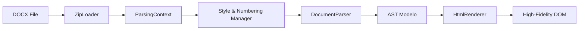

# DocxParser

A high-fidelity DOCX parser built with a **Pipeline + AST** architecture in TypeScript. Specifically optimized for accurate browser rendering (line height, spacing, and pagination balance).

[](https://opensource.org/licenses/MIT)
[](https://www.typescriptlang.org/)

## 🚀 Key Features

- **High-Fidelity Rendering**: Intelligent line height compensation (1.15x ratio), paragraph spacing inheritance, and standard font metrics.
- **Dynamic Pagination**: Real-time content overflow detection with support for headers, footers, and dynamic page numbering (**PAGE**/**NUMPAGES**).
- **AST-Driven**: Converts DOCX XML into a clean Abstract Syntax Tree before rendering.
- **Rich Style Support**: Full style chain resolution (basedOn) for both paragraphs and runs.
- **Modern UI Components**: Comes with a sleek, Glassmorphism-style demo application.

## 🏗️ Architecture



## 📦 Installation

```bash
npm install docx-parser
```

## 🏁 Quick Start

### Basic Rendering

```typescript
import { DocxParser } from 'docx-parser';

const parser = new DocxParser();

// 1. Parse to AST
const docModel = await parser.parse(buffer);

// 2. Render to DOM
const targetElement = document.getElementById('preview');
parser.render(docModel, targetElement);
```

### Accessing Metadata

```typescript
const docModel = await parser.parse(buffer);
console.log('Title:', docModel.metadata.title);
console.log('Creator:', docModel.metadata.creator);
```

## 🛠️ API Reference

### `DocxParser`

#### `async parse(data: ArrayBuffer | Blob | File): Promise<DocumentModel>`
Parses the input data into a structured AST.

#### `render(docModel: DocumentModel, target: HTMLElement): void`
Standard high-fidelity renderer that mounts the document into a container.

## 🎨 Demo

The project includes a modern Vue 3 demo. To run it:

```bash
npm run dev:demo
```

## 📄 License

MIT © [miyuesc](https://github.com/miyuesc)